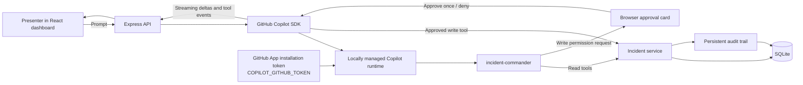
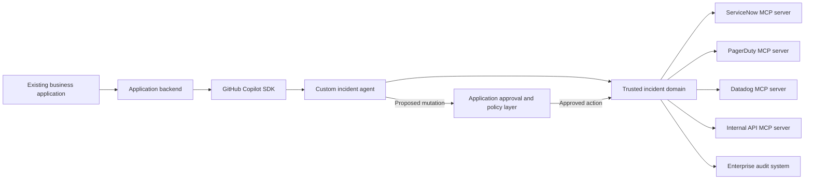

# Incident Command Center demo flow

## Audience setup

> **Imagine this is your existing business application.** It already owns the incident
> workflow, operational data, permissions, and audit trail. GitHub Copilot SDK is embedded
> server-side so the application can add an intelligent Incident Commander without
> sending credentials or direct database access to the browser.

The v1 demo uses deterministic pre-seeded events as a demo adapter. The data behaves like
real application data: approved writes persist in SQLite, the UI refreshes immediately,
and every action or denial is auditable.

## Rehearse

```bash
npm install
npm run db:reset
npm run dev
```

Open <http://localhost:5173>, confirm the top-right badge says **Copilot healthy**, and
select `INC-1042` if it is not already selected.

Run `npm run db:reset` before every customer session. It restores the checkout incident
to `Triggered`, removes its assignee and presenter-added timeline notes, restores all
secondary incidents, and resets the audit history deterministically. The browser’s
**Reset demo data** control provides the same reset with an explicit confirmation.

## Click-by-click flow

1. **Orient the audience**
   - Point out the incident list, severity/status signals, customer impact, service
     health, timeline, and persistent audit activity.
   - Select the P1 **Checkout failures after payment-service rollout** incident.
   - Say: “This is a normal business application. The application remains the system of
     record.”

2. **Request an incident briefing**
   - In **Incident Commander**, click **Start the briefing** or enter exactly:

     > Brief me on this incident and identify the most likely cause.

   - Point out the streamed answer and visible read-tool activity.
   - The expected conclusion is that `payment-service v4.18.0` changed merchant token
     cache keys, collapsing the cache hit rate and overloading the authorization
     dependency. Database and network signals remain healthy.

3. **Explain trusted tools**
   - Read tools run automatically because they cannot mutate incident state.
   - The assistant receives typed results from the incident service, not unrestricted
     database or browser access.
   - The custom `incident-commander` agent can see only the seven domain tools required
     for the scenario.

4. **Request coordinated response actions**
   - Click **Coordinate response** or enter exactly:

     > Assign this incident to Maya Patel, change the status to Investigating, and add a timeline note that the team is validating a rollback of payment-service v4.18.0.

5. **Demonstrate approval**
   - For each write tool, pause on the approval card.
   - Show the exact tool name, incident, and arguments.
   - Approve the assignment and status change.
   - Optionally deny the timeline note first to demonstrate a safe denial, then repeat
     the prompt and approve it.
   - Emphasize that the SDK permission callback is waiting; the mutation has not run
     yet. Approval applies once and never becomes a blanket browser permission.

6. **Show persistent results**
   - Watch the dashboard update immediately.
   - Confirm the incident is assigned to Maya Patel and is `Investigating`.
   - Find the new note in the timeline.
   - Show correlated success or denial entries in **Audit activity**.

## Talking points

### Server-to-server authentication and billing

- The browser never sees a GitHub credential.
- The backend creates a GitHub App JWT and exchanges it for a one-hour installation
  token requesting `copilot_requests: write` for the configured repository ID.
- The resulting `ghs_` token is passed to the locally managed runtime through
  `COPILOT_GITHUB_TOKEN`, not the SDK user-token option.
- Logged-in-user fallback is disabled. A developer’s `gh` or Copilot CLI login cannot
  accidentally make the demo appear healthy.
- Usage is attributed to the organization that owns the GitHub App installation.
- The App must be installed with **All repositories** access for the current Copilot
  permission check, and the organization policy must allow GitHub App Copilot requests.
- Before token expiry, the backend stops and recreates the managed runtime with a fresh
  installation token.

### Streaming

- The SDK streams `assistant.message_delta` events into the panel.
- `tool.execution_start` and `tool.execution_complete` events create the visible
  activity trace.
- Authentication and tool failures are surfaced as errors; the app never displays a
  fabricated successful Copilot response.

### Custom tools and approval

- Reads are typed, permission-free, and handled by the incident domain service.
- Writes are typed but never auto-approved.
- The SDK `onPermissionRequest` callback creates a browser approval request and waits
  for an approve/deny decision.
- The write handler runs only after approval. A denial is returned to the agent and is
  also recorded in the application audit trail.

### Auditability

- Browser session IDs correlate Copilot activity with incident audit events.
- Every successful write records actor, action, exact arguments, timestamp, outcome,
  and session ID.
- Denials are first-class events, demonstrating that governance is visible rather than
  silently swallowed.

## Implemented v1 path



The seeded timeline, deployment, monitoring, and service-health records are the v1 demo
adapter. They make the story reliable and resettable while preserving a production-style
domain boundary.

## Optional MCP-backed production path

Do not implement this path in v1. It is the customer architecture conversation after the
working demo.

Real systems such as ServiceNow, PagerDuty, Datadog, or internal APIs can provide live
context and governed actions through trusted MCP servers. The application can keep the
same incident tools and approval UX while replacing the seed adapter behind the domain
boundary.

See
[Extending Copilot SDK with MCP](https://docs.github.com/en/enterprise-cloud@latest/copilot/how-tos/copilot-sdk/features/mcp).



The production design still keeps credentials server-side, narrows tool access, requires
human approval for mutations, and records outcomes in the customer’s system of record.
